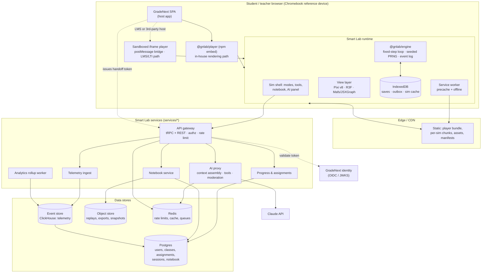

# GradeNext Smart Lab — Technical Specification

> Implementation contract for the simulation platform described in [SMART_LAB_PLAN.md](./SMART_LAB_PLAN.md) and scoped by [SIMULATION_CATALOG.md](./SIMULATION_CATALOG.md).

**Status:** Draft for engineering review · **Spec version:** 1.0.0 · **Date:** 2026-08-28

This document specifies interfaces, schemas, and protocols. Architecture *choices* (stack, licensing, monorepo shape) are settled in the master plan §7 and are treated here as given. Everything below is meant to be typed into an editor.

---

## Table of Contents

0. [Conventions & normative language](#0-conventions--normative-language)
1. [System context](#1-system-context)
2. [Engine core API](#2-engine-core-api)
3. [Sim manifest schema](#3-sim-manifest-schema)
4. [Guided Lab DSL](#4-guided-lab-dsl)
5. [Rendering architecture](#5-rendering-architecture)
6. [State, persistence & sharing](#6-state-persistence--sharing)
7. [Backend services & data model](#7-backend-services--data-model)
8. [Analytics & event schema](#8-analytics--event-schema)
9. [AI tutor integration contract](#9-ai-tutor-integration-contract)
10. [Testing strategy](#10-testing-strategy)
11. [Build & CI/CD](#11-build--cicd)
12. [Security & privacy](#12-security--privacy)
13. [Performance engineering](#13-performance-engineering)
14. [Appendix A — error taxonomy](#appendix-a--error-taxonomy)

---

## 0. Conventions & normative language

- **MUST / SHOULD / MAY** carry RFC-2119 meaning. A sim package that violates a MUST fails CI (§11.4).
- Package names are `@gnlab/*`; sim packages are `@gnlab/sim-<domain>.<slug>` with sim ids of the form `<domain>.<slug>` where `domain ∈ {phys, chem, bio, earth, math}`.
- All wire formats are JSON, `camelCase`, UTC ISO-8601 timestamps, and validated at both ends with the *same* zod schema exported from `@gnlab/manifest` or `@gnlab/protocol`.
- Model code is **pure**: no `Math.random`, `Date.now`, `performance.now`, DOM access, or network I/O inside `SimModel`. ESLint rule `gnlab/pure-model` enforces this on `sims/*/model/**`.
- Semver applies per sim package, independently of the platform (§11.3). `paramsSchema` changes are breaking and require a migration (§6.4).

---

## 1. System context



**Trust boundaries.** (a) Browser ↔ gateway: bearer JWT, all input untrusted. (b) Iframe ↔ host: `postMessage` with strict origin allowlist (§12.3). (c) Gateway ↔ AI proxy: PII-stripped context only (§9.4). The client never holds a model-provider key.

---

## 2. Engine core API

`@gnlab/engine` has no rendering, DOM, or React dependency and must stay under 18 KB gz.

### 2.1 Model contract

```ts
/** S = state (plain, serializable). P = params (zod-validated, plain). */
export interface SimModel<S, P, D = unknown> {
  readonly id: string;                       // matches manifest.id
  readonly stateVersion: number;             // bumped on any S shape change

  /** Pure construction. Called on load, reset, and replay. */
  init(params: Readonly<P>, ctx: SimContext): S;

  /** Advance exactly dt seconds. MUST be pure: (S, dt, inputs) -> S. */
  step(state: S, dt: Seconds, inputs: readonly InputEvent[], ctx: SimContext): S;

  /** Applied when the student edits a control mid-run; may restructure state. */
  applyParams(state: S, next: Readonly<P>, prev: Readonly<P>, ctx: SimContext): S;

  /** Cheap memoized read-model for views, tools, graphs, AI context. */
  derive(state: S, params: Readonly<P>): D;

  /** Snapshot/restore. Default impls are structuredClone-based. */
  serialize?(state: S): JsonValue;
  deserialize?(json: JsonValue, stateVersion: number): S;

  /** Optional migration of persisted state across stateVersion bumps. */
  migrateState?(json: JsonValue, from: number, to: number): JsonValue;
}

export type Seconds = number & { readonly __unit: "s" };
export type JsonValue =
  | null | boolean | number | string | JsonValue[] | { [k: string]: JsonValue };
```

`derive` is the **only** channel from model to view. Views MUST NOT read raw `S`. `derive` is memoized on `(stateRef, paramsRef)`; sims with expensive derivations SHOULD return a stable object identity when nothing changed so React and Pixi can bail out.

### 2.2 Context and RNG

```ts
export interface SimContext {
  readonly rng: Rng;
  readonly tick: number;              // integer model ticks since init
  readonly time: Seconds;             // tick * DT, exact multiple
  readonly gradeBand: GradeBand;      // "K-2" | "3-5" | "6-8" | "9-12"
  readonly quality: QualityTier;      // "low" | "med" | "high" (§13.2)
  readonly units: UnitSystem;         // "si" | "us-customary"
  /** Structured, model-emitted signals for analytics/labs. Never side effects. */
  emit(signal: ModelSignal): void;
  /** Dev-only assertion; compiled out of production builds. */
  invariant(cond: boolean, msg: string): void;
}

export interface Rng {
  /** [0,1) */ next(): number;
  int(minInclusive: number, maxExclusive: number): number;
  normal(mean?: number, sd?: number): number;
  pick<T>(xs: readonly T[]): T;
  /** Deterministic child stream — use per-agent so agent count doesn't shift the parent stream. */
  fork(label: string): Rng;
  readonly seed: number;             // uint32
  getCounter(): number;              // snapshot for serialization
  setCounter(n: number): void;
}
```

RNG is a counter-based PRNG (`sfc32` seeded through `splitmix32`) so the stream position is a single integer and snapshots restore exactly. `fork(label)` derives a child seed from `hash32(seed ^ hash32(label))` — adding agents never perturbs existing streams, which keeps golden tests stable as sims grow.

`ModelSignal` is `{ kind: string; at: Seconds; data?: Record<string, number | string | boolean> }` — e.g. `{kind:"collision", data:{ke_before:12.5, ke_after:9.1}}`. Signals feed lab checkpoints (§4), telemetry (§8), and AI context (§9).

### 2.3 Units & quantities

Dimensional safety is a compile-time brand plus a runtime tag, with a **closed table** of the ~40 quantity kinds the catalog actually needs. General type-level dimension arithmetic was rejected: it blows up `tsc` time across 164 packages for no pedagogical gain.

```ts
declare const KIND: unique symbol;
export type Q<K extends QuantityKind> = number & { readonly [KIND]: K };

export type QuantityKind =
  | "length" | "time" | "mass" | "current" | "temperature" | "amount" | "angle"
  | "velocity" | "acceleration" | "force" | "energy" | "power" | "momentum"
  | "charge" | "voltage" | "resistance" | "capacitance" | "frequency"
  | "area" | "volume" | "density" | "pressure" | "concentration" | "dimensionless";

/** Products/quotients resolved by lookup, not arithmetic. */
interface MulTable {
  "force*length": "energy";     "velocity*time": "length";
  "mass*velocity": "momentum";  "current*resistance": "voltage";
  "voltage*current": "power";   "acceleration*time": "velocity";
  // …closed set, exhaustively unit-tested
}

export function add<K extends QuantityKind>(a: Q<K>, b: Q<K>): Q<K>;       // length+time = type error
export function mul<A extends QuantityKind, B extends QuantityKind>(
  a: Q<A>, b: Q<B>
): Q<MulOf<A, B>>;
export function q<K extends QuantityKind>(kind: K, siValue: number): Q<K>;

/** Display formatting is the only place unit systems exist. Models are SI-only. */
export interface UnitFormatter {
  format<K extends QuantityKind>(v: Q<K>, kind: K, opts?: {
    system?: UnitSystem; sigFigs?: number; preferUnit?: string; locale?: string;
  }): { text: string; value: number; unit: string; unitAria: string };
}
```

Rules: **models compute in SI only**; conversion happens at the formatter, once, at render time. Every readout in the UI goes through `UnitFormatter` so `unitAria` ("meters per second") is available to screen readers while the visual shows `m/s`.

### 2.4 Loop, input, and time

```ts
export const DT: Seconds = (1 / 120) as Seconds;
export const MAX_CATCHUP_TICKS = 12;    // ~100 ms; beyond this we drop time

export interface EngineLoop<S, P, D> {
  readonly state: () => Readonly<S>;
  readonly derived: () => Readonly<D>;
  readonly tick: () => number;
  /** Fractional tick position for view interpolation, in [0,1). */
  readonly alpha: () => number;

  start(): void;
  pause(): void;
  resume(): void;
  /** Advance exactly n ticks regardless of wall clock (tests, step button, replay). */
  advance(ticks: number): void;
  setRate(multiplier: 0.1 | 0.25 | 0.5 | 1 | 2 | 4): void;
  setParams(next: Partial<P>, origin: InputOrigin): void;
  reset(seed?: number): void;

  enqueue(ev: InputEvent): void;
  subscribe(fn: (frame: FrameInfo) => void): () => void;   // called once per rAF
  dispose(): void;
}

export interface FrameInfo {
  tick: number; alpha: number; time: Seconds;
  ticksThisFrame: number; frameMs: number; droppedTicks: number;
}
```

The accumulator clamps to `MAX_CATCHUP_TICKS` and reports `droppedTicks`; a sim that persistently drops ticks triggers automatic quality-tier downgrade (§13.2). `advance()` bypasses wall time entirely, which is what makes tests and replays exact.

```ts
export type InputOrigin = "user" | "lab" | "ai" | "replay" | "url";

export type InputEvent =
  | { t: "pointer"; phase: "down" | "move" | "up" | "cancel";
      id: number; x: number; y: number; targetId?: string; origin: InputOrigin }
  | { t: "drag"; targetId: string; x: number; y: number;
      phase: "start" | "move" | "end"; origin: InputOrigin }
  | { t: "key"; code: string; phase: "down" | "up";
      mods: { shift: boolean; alt: boolean; ctrl: boolean }; origin: InputOrigin }
  | { t: "param"; key: string; value: JsonValue; origin: InputOrigin }
  | { t: "action"; name: string; args?: JsonValue; origin: InputOrigin }   // "launch", "closeSwitch"
  | { t: "tool"; tool: ToolId; op: ToolOp; origin: InputOrigin }
  | { t: "mode"; mode: SimMode; origin: InputOrigin };

/** Recorded form: input + the tick it lands on. This tuple is the replay unit. */
export interface TimedInput { tick: number; ev: InputEvent }
```

Events are queued and **drained at tick boundaries**, never applied mid-frame — this is the reason replays are exact across devices with different frame rates.

### 2.5 Recorder & replay

```ts
export interface Recorder {
  readonly recording: boolean;
  start(opts?: { maxEvents?: number }): void;
  stop(): Replay;
  /** Periodic keyframes bound worst-case scrub cost. Default every 1200 ticks (10 s). */
  keyframe(): void;
}

export interface Replay {
  v: 1;
  simId: string; simVersion: string; stateVersion: number;
  seed: number;
  params: JsonValue;                 // params at t=0, post-migration
  inputs: TimedInput[];              // strictly non-decreasing tick
  keyframes?: { tick: number; state: JsonValue }[];
  durationTicks: number;
  /** FNV-1a-64 of the canonical serialization at durationTicks. Verified on playback. */
  endHash: string;
}

export interface ReplayPlayer<S> {
  seekTick(tick: number): void;      // nearest keyframe + fast-forward via advance()
  playbackRate(m: number): void;
  onDivergence(fn: (at: number, expected: string, actual: string) => void): void;
}
```

Replay files are gzip-compressed newline-delimited JSON in object storage. A 10-minute pendulum lab with 400 interactions is ~6 KB gz. `onDivergence` firing in production is a P1 bug: it means a model broke purity or a dependency changed numerics.

---

## 3. Sim manifest schema

`@gnlab/manifest` exports one zod schema consumed by: the catalog app, the player loader, the authoring QA harness, standards search, the AI context builder, CI budget checks, and the teacher assignment picker.

```ts
import { z } from "zod";

export const SimId = z.string().regex(/^(phys|chem|bio|earth|math)\.[a-z0-9-]{3,40}$/);
export const GradeBand = z.enum(["K-2", "3-5", "6-8", "9-12"]);
export const SimMode = z.enum(["explore", "guided", "challenge"]);
export const I18nText = z.record(z.string().min(1)).refine(r => "en" in r, "en required");

export const Capability = z.enum([
  "measure.ruler", "measure.protractor", "measure.stopwatch", "measure.balance",
  "measure.thermometer", "measure.voltmeter", "measure.ammeter", "measure.ph",
  "graph.live", "graph.phase", "data.table", "data.csv", "snapshot.png",
  "slowmo", "step", "vectors", "freebody", "sonification", "camera.3d",
]);

export const ParamSpec = z.object({
  key: z.string(),
  kind: z.enum(["number", "int", "bool", "enum", "vector2", "select"]),
  label: I18nText,
  unitKind: z.string().optional(),                 // QuantityKind, SI
  min: z.number().optional(), max: z.number().optional(), step: z.number().optional(),
  default: z.unknown(),
  options: z.array(z.object({ value: z.unknown(), label: I18nText })).optional(),
  /** Per-band exposure: hidden params are fixed at default for that band. */
  bands: z.record(GradeBand, z.object({
    visible: z.boolean().default(true),
    min: z.number().optional(), max: z.number().optional(), step: z.number().optional(),
    default: z.unknown().optional(),
  })).optional(),
  /** Stable short code for URL state (§6.2). MUST be unique and never reused. */
  urlKey: z.string().length(2),
  aiWritable: z.boolean().default(false),          // §9.3 tool whitelist
});

export const SimManifest = z.object({
  id: SimId,
  version: z.string(),                              // semver of the sim package
  stateVersion: z.number().int().positive(),
  title: I18nText,
  blurb: I18nText,
  subject: z.enum(["physics", "chemistry", "biology", "earth", "math"]),
  topics: z.array(z.string()).min(1),               // internal taxonomy ids
  gradeBands: z.array(GradeBand).min(1),
  tier: z.enum(["T1", "T2", "T3"]),

  standards: z.object({
    ngss: z.array(z.string()).default([]),          // "MS-PS2-2"
    ccssMath: z.array(z.string()).default([]),      // "HSF.IF.B.4"
    stateOverlays: z.record(z.array(z.string())).default({}),  // { "TX-TEKS": [...] }
  }),
  learningGoals: z.array(z.object({
    id: z.string(), text: I18nText, band: GradeBand,
    assessedBy: z.array(z.string()).default([]),    // lab/challenge ids
  })).min(1),

  params: z.array(ParamSpec).min(1),
  paramsSchemaRef: z.string(),                      // module export path of the zod schema
  capabilities: z.array(Capability).default([]),
  modes: z.array(SimMode).min(1),

  engine: z.object({
    physics: z.enum(["none", "rapier2d-deterministic", "rapier3d", "mna", "abm", "custom"]),
    tickRate: z.literal(120),
    workerEligible: z.boolean().default(false),
    maxAgents: z.number().int().optional(),
    integrator: z.enum(["semi-implicit-euler", "rk4", "verlet", "analytic"]).optional(),
  }),

  entry: z.object({
    component: z.string(),                          // "./ProjectileSim.tsx"
    model: z.string(),                              // "./model/index.ts"
    renderer: z.enum(["pixi", "r3f", "mafs", "jsxgraph", "dom"]),
  }),

  labs: z.array(z.object({
    id: z.string(), file: z.string(), title: I18nText,
    bands: z.array(GradeBand), estMinutes: z.number().int(),
  })).default([]),
  challenges: z.array(z.object({
    id: z.string(), file: z.string(), title: I18nText,
    bands: z.array(GradeBand), scoring: z.enum(["binary", "tiered", "rubric"]),
  })).default([]),

  a11y: z.object({
    keyboardMap: z.string(),                        // module exporting KeyboardMap
    narratorRef: z.string(),                        // ExperimentNarrator implementation
    dataTableAlternative: z.boolean().default(true),
    sonification: z.boolean().default(false),
    reducedMotionStrategy: z.enum(["static-frame", "slow", "none"]).default("slow"),
    wcagAudited: z.string().optional(),             // ISO date of last manual audit
  }),

  aiTutor: z.object({
    enabled: z.boolean().default(true),
    contextBuilder: z.string(),                     // "./aiContext.ts"
    writableParams: z.array(z.string()).default([]),// subset of params[].key
    misconceptions: z.array(z.object({
      id: z.string(), description: z.string(), detector: z.string().optional(),
    })).default([]),
    kidModeChips: z.boolean().default(false),       // K-5: choice chips, no free text
  }),

  perfBudget: z.object({
    jsGzipKB: z.number().max(300),
    assetsGzipKB: z.number().max(400),
    heapMB: z.number().max(120),
    p50FrameMs: z.number().max(8),
    p95FrameMs: z.number().max(16.7),
    ttiMsCached: z.number().max(3000),
  }),

  i18n: z.object({ locales: z.array(z.string()).default(["en"]), rtlSafe: z.boolean().default(true) }),
  license: z.object({ assets: z.array(z.object({ path: z.string(), source: z.string(), license: z.string() })).default([]) }),
});
export type SimManifest = z.infer<typeof SimManifest>;
```

### 3.1 Worked example — `phys.dc-circuit`

```ts
export default SimManifest.parse({
  id: "phys.dc-circuit",
  version: "1.4.0",
  stateVersion: 3,
  title: { en: "Circuit Builder", es: "Constructor de circuitos" },
  blurb: { en: "Build DC circuits and measure current, voltage, and resistance." },
  subject: "physics",
  topics: ["electricity.dc", "electricity.ohms-law", "energy.electrical"],
  gradeBands: ["3-5", "6-8", "9-12"],
  tier: "T1",
  standards: {
    ngss: ["4-PS3-2", "MS-PS3-5", "HS-PS3-3"],
    ccssMath: ["7.RP.A.2", "HSF.LE.A.1"],
    stateOverlays: { "TX-TEKS": ["5.6B", "8.5"] },
  },
  learningGoals: [
    { id: "lg.closed-loop", text: { en: "A bulb lights only in a complete loop." }, band: "3-5", assessedBy: ["lab.first-circuit"] },
    { id: "lg.ohm", text: { en: "Current is proportional to voltage and inversely proportional to resistance." }, band: "6-8", assessedBy: ["lab.ohms-law", "chal.target-current"] },
    { id: "lg.series-parallel", text: { en: "Predict equivalent resistance of series and parallel networks." }, band: "9-12", assessedBy: ["lab.equivalent-r"] },
  ],
  params: [
    { key: "emf", kind: "number", label: { en: "Battery voltage" }, unitKind: "voltage",
      min: 0, max: 24, step: 0.1, default: 6, urlKey: "ev", aiWritable: true,
      bands: { "3-5": { min: 0, max: 9, step: 1 }, "9-12": { max: 24 } } },
    { key: "resistance", kind: "number", label: { en: "Resistance" }, unitKind: "resistance",
      min: 1, max: 1000, step: 1, default: 100, urlKey: "rr", aiWritable: true },
    { key: "internalR", kind: "number", label: { en: "Internal resistance" }, unitKind: "resistance",
      min: 0, max: 5, step: 0.1, default: 0, urlKey: "ir", aiWritable: false,
      bands: { "3-5": { visible: false }, "6-8": { visible: false } } },
    { key: "showElectrons", kind: "bool", label: { en: "Show charge flow" }, default: true, urlKey: "se", aiWritable: true },
    { key: "solver", kind: "enum", label: { en: "Solver" }, default: "mna",
      options: [{ value: "mna", label: { en: "Full network" } }, { value: "single-loop", label: { en: "Single loop" } }],
      urlKey: "sv", aiWritable: false },
  ],
  paramsSchemaRef: "./model/params#CircuitParams",
  capabilities: ["measure.voltmeter", "measure.ammeter", "graph.live", "data.table", "data.csv", "snapshot.png", "slowmo", "step"],
  modes: ["explore", "guided", "challenge"],
  engine: { physics: "mna", tickRate: 120, workerEligible: true, integrator: "analytic" },
  entry: { component: "./CircuitSim.tsx", model: "./model/index.ts", renderer: "pixi" },
  labs: [
    { id: "lab.first-circuit", file: "./labs/first-circuit.lab.ts", title: { en: "Make it light up" }, bands: ["3-5"], estMinutes: 12 },
    { id: "lab.ohms-law", file: "./labs/ohms-law.lab.ts", title: { en: "Discover Ohm's Law" }, bands: ["6-8", "9-12"], estMinutes: 25 },
    { id: "lab.equivalent-r", file: "./labs/equivalent-r.lab.ts", title: { en: "Series and parallel" }, bands: ["9-12"], estMinutes: 30 },
  ],
  challenges: [
    { id: "chal.target-current", file: "./challenges/target-current.ts", title: { en: "Hit 0.25 A" }, bands: ["6-8", "9-12"], scoring: "tiered" },
  ],
  a11y: {
    keyboardMap: "./a11y/keyboard.ts", narratorRef: "./a11y/narrator.ts",
    dataTableAlternative: true, sonification: true, reducedMotionStrategy: "static-frame",
    wcagAudited: "2026-07-14",
  },
  aiTutor: {
    enabled: true, contextBuilder: "./aiContext.ts",
    writableParams: ["emf", "resistance", "showElectrons"],
    misconceptions: [
      { id: "current-consumed", description: "Believes current is used up by the bulb", detector: "./detectors/currentConsumed.ts" },
      { id: "voltage-flows", description: "Describes voltage as flowing through components" },
    ],
    kidModeChips: false,
  },
  perfBudget: { jsGzipKB: 84, assetsGzipKB: 60, heapMB: 55, p50FrameMs: 4.5, p95FrameMs: 12, ttiMsCached: 1800 },
  i18n: { locales: ["en", "es"], rtlSafe: true },
  license: { assets: [] },
});
```

---

## 4. Guided Lab DSL

Labs are **data, not code**: a typed object graph authored in TS (with a YAML front-end for the authoring app that compiles to the same shape). This keeps labs translatable, diffable, verifiable, and renderable by one runtime component.

### 4.1 Types

```ts
export interface Lab<P = JsonValue, D = unknown> {
  id: string; simId: string; version: string;
  title: I18n; bands: GradeBand[]; estMinutes: number;
  /** Params forced at lab start; student may still change unlocked ones. */
  setup: { params: Partial<P>; lock?: (keyof P)[]; seed?: number; mode?: "explore" };
  steps: LabStep<P, D>[];
  /** Ordered fallback if a checkpoint is failed repeatedly. */
  hintLadder?: HintPolicy;
  completion: { minCheckpoints?: number; requireAll?: boolean; awards?: string[] };
}

export interface LabStep<P, D> {
  id: string;
  prompt: I18n;                       // rendered as the step card body
  media?: { kind: "image" | "diagram" | "katex"; src: string; alt: I18n };
  /** What the student must do before the step can pass. */
  requires?: Requirement<P, D>[];
  checkpoint?: Checkpoint<P, D>;
  /** Free-response or structured capture written to the notebook. */
  capture?: Capture;
  hints: Hint[];                      // ladder, index 0 = gentlest
  /** UI affordances scoped to this step. */
  ui?: { highlight?: string[]; enableTools?: ToolId[]; disableParams?: (keyof P)[];
         showGraph?: string; band?: Partial<Record<GradeBand, { prompt?: I18n }>> };
  onEnter?: { params?: Partial<P>; action?: string; reset?: boolean };
}

export type Requirement<P, D> =
  | { kind: "dataRows"; table: string; min: number;
      distinct?: { column: string; min: number; tolerance?: number } }
  | { kind: "measurement"; tool: ToolId; min: number }
  | { kind: "paramSwept"; key: keyof P; distinctValues: number; range?: [number, number] }
  | { kind: "signal"; signal: string; min: number }
  | { kind: "elapsed"; seconds: number };

export interface Checkpoint<P, D> {
  id: string;
  /** Pure predicate over sim state + collected data. No side effects, no I/O. */
  predicate: Predicate<P, D>;
  /** Student-facing statement of the target. */
  goal: I18n;
  /** Shown when predicate is false; may be a function of the mismatch. */
  onFail?: I18n | ((ctx: PredicateCtx<P, D>) => I18n);
  autoVerify: "onChange" | "onSubmit" | "continuous";
  maxAttempts?: number;               // after which the ladder auto-advances
  weight?: number;                    // contribution to mastery signal
}

export type Predicate<P, D> = (ctx: PredicateCtx<P, D>) => boolean | PredicateResult;

export interface PredicateCtx<P, D> {
  params: Readonly<P>;
  derived: Readonly<D>;
  signals: ReadonlyArray<ModelSignal>;
  data: DataTableView;                // rows collected by the student
  answers: Record<string, AnswerValue>;
  fit: FitHelpers;                    // linear/power/exp regression on collected data
  approx(a: number, b: number, relTol?: number): boolean;
  attempt: number;
}

export interface PredicateResult { pass: boolean; detail?: Record<string, number | string> }

export type Capture =
  | { kind: "numeric"; id: string; label: I18n; unitKind?: string;
      expect?: { value: number; relTol: number } }
  | { kind: "choice"; id: string; label: I18n; options: { value: string; label: I18n }[];
      correct?: string; distractorFeedback?: Record<string, I18n> }
  | { kind: "text"; id: string; label: I18n; minWords?: number; rubricRef?: string }
  | { kind: "dataTable"; id: string; columns: { key: string; label: I18n; unitKind?: string; source: "auto" | "manual" }[] }
  | { kind: "graphSketch"; id: string; label: I18n; expectShape?: "linear" | "inverse" | "quadratic" | "sqrt" };

export interface Hint {
  level: 1 | 2 | 3 | 4;               // 1 nudge · 2 focus · 3 procedure · 4 near-answer
  text: I18n;
  cost?: number;                      // mastery penalty; 0 for level 1
  reveal?: { params?: Record<string, JsonValue>; highlight?: string[] };
  aiFallback?: boolean;               // if true, level is handled by the tutor instead
}

export interface HintPolicy {
  autoOfferAfterFailedAttempts: number;   // default 2
  autoOfferAfterIdleSeconds: number;      // default 90
  maxLevelWithoutRequest: 2;
}
```

### 4.2 Rendering contract

The runtime component `<GuidedLabPanel lab={lab} engine={engine} />` renders a right-rail (or bottom sheet on <768 px) with: step counter, prompt card, requirement progress chips ("3 / 5 rows collected"), a capture widget, and a hint button whose ladder state is per-student and persisted. Behavior:

1. `onEnter` applies params through the engine as `{t:"param", origin:"lab"}` events — recorded in the replay like any other input.
2. `autoVerify:"continuous"` re-evaluates the predicate on every derived-state change, throttled to 10 Hz; `"onChange"` on param/data changes only; `"onSubmit"` on button press.
3. On pass: emit `lab_checkpoint_passed` (§8), animate the chip, unlock the next step, autosave a snapshot.
4. On fail: emit `lab_checkpoint_failed` with `detail`, render `onFail`, increment `attempt`, and consult `HintPolicy`.
5. Locked params render disabled with an explanatory tooltip; they are still keyboard-focusable and announce their locked state.
6. Every prompt, hint, and failure message is announced through the shared `aria-live="polite"` narrator region.

### 4.3 Full example — "Discover Ohm's Law"

```ts
import { defineLab, linearFit } from "@gnlab/labs";
import type { CircuitParams, CircuitDerived } from "../model/params";

export default defineLab<CircuitParams, CircuitDerived>({
  id: "lab.ohms-law",
  simId: "phys.dc-circuit",
  version: "1.2.0",
  title: { en: "Discover Ohm's Law" },
  bands: ["6-8", "9-12"],
  estMinutes: 25,
  setup: {
    params: { emf: 2, resistance: 100, internalR: 0, showElectrons: true, solver: "mna" },
    lock: ["internalR", "solver"],
    seed: 20260828,
  },
  hintLadder: { autoOfferAfterFailedAttempts: 2, autoOfferAfterIdleSeconds: 90, maxLevelWithoutRequest: 2 },

  steps: [
    {
      id: "s1.predict",
      prompt: { en: "The battery is set to 2 V with a 100 Ω resistor. If you double the battery voltage, what happens to the current?" },
      capture: {
        kind: "choice", id: "predict.doubleV",
        label: { en: "The current will…" },
        options: [
          { value: "half",   label: { en: "be cut in half" } },
          { value: "same",   label: { en: "stay the same" } },
          { value: "double", label: { en: "double" } },
          { value: "quad",   label: { en: "quadruple" } },
        ],
        correct: "double",
        distractorFeedback: {
          same: { en: "Hold that thought — you'll test it in a moment." },
          half: { en: "Interesting. Collect the data and see." },
        },
      },
      // Predictions are never gated on correctness — commitment is the point.
      hints: [{ level: 1, text: { en: "Don't worry about being right. Commit to a guess, then test it." }, cost: 0 }],
      ui: { disableParams: ["resistance"] },
    },

    {
      id: "s2.collect-v",
      prompt: { en: "Keep R at 100 Ω. Set the battery to at least five different voltages and record the ammeter reading each time." },
      ui: { enableTools: ["measure.ammeter", "measure.voltmeter"], highlight: ["ctrl.emf", "tool.ammeter"], showGraph: "I-vs-V" },
      requires: [
        { kind: "paramSwept", key: "emf", distinctValues: 5, range: [1, 12] },
        { kind: "dataRows", table: "ivr", min: 5, distinct: { column: "V", min: 5, tolerance: 0.05 } },
      ],
      capture: {
        kind: "dataTable", id: "ivr",
        columns: [
          { key: "V", label: { en: "Voltage (V)" }, unitKind: "voltage", source: "auto" },
          { key: "I", label: { en: "Current (A)" }, unitKind: "current", source: "auto" },
          { key: "R", label: { en: "Resistance (Ω)" }, unitKind: "resistance", source: "auto" },
        ],
      },
      checkpoint: {
        id: "cp.linear-IV",
        goal: { en: "Five good readings at a constant resistance." },
        autoVerify: "onChange",
        weight: 2,
        predicate: ({ data, fit }) => {
          const rows = data.table("ivr").rows;
          if (rows.length < 5) return false;
          if (!rows.every(r => Math.abs(r.R - rows[0].R) < 1e-6)) {
            return { pass: false, detail: { reason: "R_changed" } };
          }
          const f = fit.linear(rows.map(r => [r.V, r.I]));
          return { pass: f.r2 > 0.99, detail: { r2: f.r2, slope: f.slope } };
        },
        onFail: ctx =>
          ctx.detail?.reason === "R_changed"
            ? { en: "Resistance changed between readings. Keep R fixed so only voltage varies." }
            : { en: "Your points aren't lining up yet. Re-check the ammeter readings." },
      },
      hints: [
        { level: 1, text: { en: "What are you allowed to change? What must stay the same?" }, cost: 0 },
        { level: 2, text: { en: "A fair test changes one variable at a time. Move only the battery slider." }, cost: 1 },
        { level: 3, text: { en: "Try 2 V, 4 V, 6 V, 8 V, 10 V. Click Record after each." }, cost: 2,
          reveal: { highlight: ["btn.record"] } },
      ],
    },

    {
      id: "s3.slope",
      prompt: { en: "Look at your I-vs-V graph. What is the slope, and what does it have to do with the resistor?" },
      ui: { showGraph: "I-vs-V" },
      capture: { kind: "numeric", id: "slope.IV", label: { en: "Slope (A/V)" },
                 expect: { value: 0.01, relTol: 0.1 } },
      checkpoint: {
        id: "cp.slope-is-1overR",
        goal: { en: "Slope equals 1/R." },
        autoVerify: "onSubmit",
        maxAttempts: 3,
        weight: 3,
        predicate: ({ answers, data, approx }) => {
          const R = data.table("ivr").rows[0].R;
          return approx(Number(answers["slope.IV"]), 1 / R, 0.10);
        },
        onFail: { en: "Close. Read two points off the line and compute rise over run — then compare with 1/R." },
      },
      hints: [
        { level: 1, text: { en: "Slope is rise over run: how much current per volt?" }, cost: 0 },
        { level: 2, text: { en: "Your resistor is 100 Ω. What is 1 ÷ 100?" }, cost: 1 },
        { level: 3, text: { en: "The slope is 0.01 A/V, which is exactly 1/R." }, cost: 3 },
      ],
    },

    {
      id: "s4.vary-r",
      prompt: { en: "Now hold the battery at 6 V and change the resistor instead. Collect five rows. What happens to the current?" },
      onEnter: { params: { emf: 6 } },
      ui: { disableParams: ["emf"], showGraph: "I-vs-R" },
      requires: [{ kind: "dataRows", table: "ivr2", min: 5, distinct: { column: "R", min: 5 } }],
      capture: {
        kind: "dataTable", id: "ivr2",
        columns: [
          { key: "R", label: { en: "Resistance (Ω)" }, unitKind: "resistance", source: "auto" },
          { key: "I", label: { en: "Current (A)" }, unitKind: "current", source: "auto" },
        ],
      },
      checkpoint: {
        id: "cp.inverse-IR",
        goal: { en: "I vs 1/R is a straight line through the origin." },
        autoVerify: "onChange",
        weight: 3,
        predicate: ({ data, fit }) => {
          const rows = data.table("ivr2").rows;
          if (rows.length < 5) return false;
          const f = fit.linear(rows.map(r => [1 / r.R, r.I]));
          return { pass: f.r2 > 0.98 && Math.abs(f.intercept) < 0.005,
                   detail: { r2: f.r2, intercept: f.intercept, slope: f.slope } };
        },
      },
      hints: [
        { level: 1, text: { en: "I vs R is curved. What could you plot instead to straighten it?" }, cost: 0 },
        { level: 2, text: { en: "Try plotting current against 1/R." }, cost: 1,
          reveal: { highlight: ["graph.axis-x-transform"] } },
      ],
    },

    {
      id: "s5.state-law",
      prompt: { en: "Write the relationship between V, I and R in your own words, then check it against your two data sets." },
      capture: { kind: "text", id: "statement.ohm", label: { en: "Ohm's Law, in your words" },
                 minWords: 12, rubricRef: "rubric.ohm-statement" },
      checkpoint: {
        id: "cp.self-check",
        goal: { en: "Your law predicts a reading you haven't taken yet." },
        autoVerify: "onSubmit",
        weight: 4,
        predicate: ({ params, derived, answers, approx }) =>
          approx(Number(answers["predict.check"]), derived.current, 0.05),
      },
      hints: [
        { level: 1, text: { en: "A law should let you predict. Predict the current at 9 V and 300 Ω before you set it." }, cost: 0 },
        { level: 4, text: { en: "V = I × R." }, cost: 4, aiFallback: true },
      ],
    },
  ],

  completion: { requireAll: false, minCheckpoints: 3, awards: ["badge.circuit-investigator"] },
});
```

Free-text captures (`s5`) are **not** auto-graded by string matching. They are stored verbatim, shown to the teacher, and optionally scored by the tutor against `rubricRef` with the result marked `aiSuggested: true` and never written to mastery without teacher confirmation (§9.5).

---

## 5. Rendering architecture

### 5.1 Layer stack

Every sim is the same five-layer sandwich; only layer 2 varies by renderer.

| z | Layer | Tech | Owner |
|---|---|---|---|
| 0 | Background / grid / axes | Pixi or CSS | shell |
| 1 | World | **Pixi v8 stage** *or* **R3F canvas** *or* **Mafs/JSXGraph SVG** | sim |
| 2 | Overlay vectors, labels, trails | Pixi container (2D) / R3F Html (3D) | sim |
| 3 | Tools & measurement | React DOM, absolutely positioned | `@gnlab/tools` |
| 4 | Controls, readouts, lab panel, AI panel | React DOM (Radix) | shell |

Exactly one `requestAnimationFrame` loop exists per player instance — owned by `EngineLoop`. Pixi's ticker and R3F's internal loop are both disabled (`autoStart:false`, `frameloop="never"`) and driven manually from the engine's `subscribe` callback. This guarantees the world and the DOM overlays are rendered from the *same* interpolated tick, so a ruler never lags the object it is measuring by a frame.

### 5.2 Model → view boundary

```ts
export interface SimView<D> {
  mount(host: HTMLElement, opts: ViewOpts): Promise<void>;
  /** Called once per rAF. derived is memoized; alpha in [0,1) for interpolation. */
  render(derived: Readonly<D>, alpha: number, frame: FrameInfo): void;
  /** Hit-test in world coordinates, for tools and pointer input. */
  pick(x: number, y: number): { targetId: string; distance: number } | null;
  toWorld(clientX: number, clientY: number): { x: number; y: number };
  toScreen(x: number, y: number): { x: number; y: number };
  setQuality(tier: QualityTier): void;
  resize(w: number, h: number, dpr: number): void;
  unmount(): void;
}
```

Rules: views are **stateless with respect to the model** (all persistent visual state that matters — trails, ghost snapshots — lives in `S` or in a derived cache keyed by tick); no view code mutates state directly, only enqueues `InputEvent`s; React components in layers 3-4 subscribe to `derived` through a `useSyncExternalStore` selector so a readout that shows only `derived.current` re-renders only when that number changes.

Interpolation: `derive` returns positions for tick `n`; the view blends with the cached tick `n-1` snapshot using `alpha`. Sims with discontinuities (collisions, teleports) mark them via `derived.discontinuityTick` so the view skips blending on that frame instead of smearing.

### 5.3 The `Measurable` interface

Measurement tools are sim-agnostic. Any sim opting into `measure.*` capabilities implements:

```ts
export interface Measurable {
  /** Points a ruler/protractor can snap to. */
  anchors(): ReadonlyArray<{ id: string; x: number; y: number; label?: string; kind: "point" | "edge" | "center" }>;
  /** Named scalar channels a probe can read. */
  probes(): ReadonlyArray<{
    id: string; kind: QuantityKind; label: I18n;
    at?: { x: number; y: number };            // spatial probes (thermometer, field meter)
    read(pointOrId?: { x: number; y: number } | string): number;   // SI
    range: [number, number]; resolution: number;
  }>;
  /** World-space scale so a ruler shows real units, not pixels. */
  worldScale(): { metersPerUnit: number; origin: { x: number; y: number } };
  /** Channels the live graph and CSV export can subscribe to. */
  series(): ReadonlyArray<{ id: string; kind: QuantityKind; label: I18n; sample(): number }>;
}
```

`@gnlab/tools` implements ruler, protractor, stopwatch, balance, thermometer, voltmeter, ammeter, pH probe once, against this interface. A new sim gets the full instrument set by implementing ~30 lines. Instrument readings are quantized to `resolution` — a virtual ruler reading to 12 significant figures teaches the wrong lesson about measurement. Each reading emits `measurement_taken` (§8) and can be pushed into the active lab's data table with one click.

### 5.4 Renderer-specific notes

- **Pixi:** one `Application` with `preference:"webgl"`, `antialias` only on `high` tier, `resolution: min(devicePixelRatio, 2)`. Sprites come from a per-sim texture atlas (§13.3). Object pooling for particles/trails; zero allocations in `render()`.
- **R3F:** `frameloop="never"` with `invalidate()` driven by the engine; `<AdaptiveDpr>` and instanced meshes for molecules/agent swarms; geometry and materials are created once and reused across renders.
- **Mafs / JSXGraph:** these are React/SVG and re-render declaratively from `derived`. They are capped at 30 Hz (visual math scenes have no benefit above it) and skipped entirely when `prefers-reduced-motion` is set and the scene is static.

---

## 6. State, persistence & sharing

### 6.1 Snapshot format

```ts
export interface Snapshot {
  v: 1;
  simId: string;
  simVersion: string;          // full semver of the sim that wrote it
  stateVersion: number;
  createdAt: string;
  seed: number; rngCounter: number; tick: number;
  params: JsonValue;           // validated against paramsSchema at that version
  state: JsonValue;            // model.serialize()
  view?: { camera?: JsonValue; tools?: ToolPlacement[] };
  lab?: { labId: string; stepIndex: number; passed: string[]; hintsUsed: Record<string, number>;
          answers: Record<string, AnswerValue>; tables: Record<string, DataRow[]> };
  hash: string;                // FNV-1a-64 over canonical JSON of {params,state,tick}
}
```

Autosave writes to IndexedDB every 20 s and on `visibilitychange`, debounced; explicit saves are named and synced.

### 6.2 URL state

Share links must survive being pasted into an LMS text box, so they are conservative about length.

```
https://lab.gradenext.com/s/phys.dc-circuit?b=6-8&m=guided&l=lab.ohms-law&p=<PAYLOAD>
```

`PAYLOAD` encoding, in order: (1) build a compact object keyed by each param's stable two-char `urlKey`, **omitting values equal to the band default**; (2) round floats to the param's `step` precision; (3) serialize with a CBOR-like packed encoder; (4) deflate-raw via `CompressionStream`; (5) base64url. A decoder tolerates unknown keys (forward compatibility) and missing keys (fills band defaults).

Typical payloads: ~40-90 chars for a params-only link. Links that also carry a full snapshot exceed URL limits, so `POST /v1/shares` stores the snapshot and returns a short id: `/s/phys.dc-circuit?k=7bQx2v`. Rule: **params-only → URL; state → share record.**

### 6.3 Versioning & migration

Three independent version axes:

| Axis | Bumped when | Compatibility rule |
|---|---|---|
| `simVersion` (semver) | any package release | patch/minor MUST load older links |
| `stateVersion` (int) | serialized `S` shape changes | requires `migrateState` |
| param `urlKey` | never reused, never repurposed | removal = permanent tombstone |

```ts
export interface ParamMigration {
  from: number; to: number;                    // paramsVersion, tracked in manifest history
  up(params: JsonValue): JsonValue;
  /** Human-readable note surfaced in the authoring diff and the changelog. */
  note: string;
}

// Example: v2 split `resistance` into a per-component list.
export const migrations: ParamMigration[] = [{
  from: 2, to: 3,
  note: "resistance:number -> resistors:{id,ohms}[]",
  up: (p: any) => ({ ...p, resistors: [{ id: "r1", ohms: p.resistance ?? 100 }], resistance: undefined }),
}];
```

Migrations are chained (`2→3→4`) and run on: URL decode, snapshot load, replay load, and assignment fetch. A migration that cannot preserve intent MUST fail loudly to a "this link was made with an older version" screen offering the nearest equivalent setup, rather than silently loading different physics. **CI test:** a corpus of frozen share links per sim (`__fixtures__/links/*.json`) is decoded on every build; any decode failure or param drift beyond tolerance fails the build.

### 6.4 IndexedDB store

Database `gnlab` version 4. Object stores:

| Store | Key | Indexes | Purpose |
|---|---|---|---|
| `saves` | `uuid` | `simId`, `updatedAt`, `syncState` | snapshots (autosave + named) |
| `labProgress` | `[simId,labId]` | `updatedAt` | step/hint/answer state |
| `notebook` | `uuid` | `simId`, `createdAt`, `syncState` | entries pending or synced |
| `outbox` | `seq` (autoinc) | `kind` | queued telemetry + mutations |
| `simCache` | `simId@version` | — | manifest + params schema for offline |
| `replays` | `uuid` | `simId`, `createdAt` | local replay buffers |

Quota policy: soft cap 60 MB; LRU eviction of `replays` then `saves` with `syncState:"synced"`. Never evict `syncState:"pending"` — instead surface a "sync when you're back online" banner.

### 6.5 Sync protocol

Last-writer-wins per record with a monotonic `rev`, plus an idempotency key so a retried flush never duplicates.

```ts
POST /v1/sync
{ deviceId, since: "2026-08-28T10:00:00Z",
  mutations: [{ idempotencyKey, kind: "save" | "notebook" | "labProgress",
                id, rev, updatedAt, payload }] }
→ 200 { serverTime, applied: [{ id, rev }],
        conflicts: [{ id, serverRev, serverPayload }],
        pull: [{ kind, id, rev, payload }] }
```

Telemetry flushes separately (§8.4) — never blocking, always fire-and-forget with `sendBeacon` on unload.

---

## 7. Backend services & data model

Internal calls are **tRPC** (shared types with the client); anything crossing an org boundary (LMS, LTI, the iframe host) is **REST + OpenAPI**. All routes are versioned under `/v1`.

### 7.1 Endpoints

| Method | Route | Request | Response | Notes |
|---|---|---|---|---|
| POST | `/v1/auth/handoff` | `{ handoffToken }` | `{ accessToken, expiresIn, user: SessionUser }` | GradeNext-signed short-lived JWT (≤60 s, single use), verified against JWKS |
| POST | `/v1/auth/refresh` | cookie | `{ accessToken, expiresIn }` | rotating refresh, `HttpOnly; SameSite=Lax` |
| GET | `/v1/catalog` | `?grade&subject&standard&q&tier` | `{ sims: SimSummary[], facets }` | edge-cached 5 min, anonymous OK |
| GET | `/v1/sims/:id/manifest` | `?version` | `SimManifest` | immutable per version, `max-age=31536000` |
| GET | `/v1/progress` | `?simId?` | `{ items: ProgressItem[] }` | student-scoped |
| POST | `/v1/progress/checkpoint` | `{ simId, labId, checkpointId, passed, attempts, hintsUsed, elapsedMs, sessionId }` | `{ mastery: MasteryDelta }` | idempotent on `(sessionId, checkpointId, attempts)` |
| GET | `/v1/assignments` | `?classId&status` | `{ assignments: Assignment[] }` | teacher and student views differ by role |
| POST | `/v1/assignments` | `AssignmentDraft` | `Assignment` | teacher only |
| GET | `/v1/assignments/:id/submissions` | `?studentId` | `{ submissions: Submission[] }` | teacher only |
| POST | `/v1/sessions` | `{ simId, simVersion, mode, band, assignmentId? }` | `{ sessionId }` | opens a `sim_session` |
| PATCH | `/v1/sessions/:id` | `{ endedAt?, activeMs?, replayKey? }` | `204` | |
| POST | `/v1/notebook` | `NotebookEntryDraft` | `NotebookEntry` | figures uploaded via presigned PUT |
| GET | `/v1/notebook` | `?simId&assignmentId&cursor` | `{ entries, nextCursor }` | |
| POST | `/v1/shares` | `{ simId, simVersion, snapshot }` | `{ key, url, expiresAt }` | ≤256 KB, 400 days TTL |
| GET | `/v1/shares/:key` | — | `{ simId, simVersion, snapshot }` | anonymous, rate-limited |
| GET | `/v1/analytics/class/:classId` | `?assignmentId&from&to` | `ClassAnalytics` | teacher only, ≥5-student aggregation floor |
| POST | `/v1/ai/turn` | `AiTurnRequest` (§9) | SSE stream of `AiTurnEvent` | strict per-user quota |
| GET | `/v1/ai/transcripts` | `?studentId&sessionId` | `{ turns: AiTurnRecord[] }` | teacher/guardian visible |
| POST | `/v1/telemetry` | `{ batch: TelemetryEvent[] }` | `202` | ≤64 KB, `Content-Encoding: gzip` |

Errors use RFC 9457 `application/problem+json` with the codes in Appendix A.

### 7.2 Data model (Postgres)

```sql
-- Identity is mirrored from GradeNext; Smart Lab is never the system of record for PII.
users(id uuid pk, gradenext_user_id text unique, role text,           -- student|teacher|admin
      grade_band text, locale text, birth_year_bucket text,           -- bucketed, not DOB
      accessibility_prefs jsonb, ai_enabled bool default true,
      created_at timestamptz, deleted_at timestamptz)

classes(id uuid pk, gradenext_class_id text unique, school_id uuid,
        name text, grade text, teacher_id uuid fk users, term text, created_at timestamptz)

enrollments(class_id uuid fk, user_id uuid fk, role text, joined_at timestamptz,
            primary key (class_id, user_id))

assignments(id uuid pk, class_id uuid fk, created_by uuid fk users,
            sim_id text, sim_pinned_version text, mode text,          -- guided|challenge|explore
            lab_id text, challenge_id text, band text,
            setup_params jsonb, due_at timestamptz,
            settings jsonb,                                           -- {aiEnabled, hintsAllowed, attempts}
            created_at timestamptz, archived_at timestamptz)

sim_sessions(id uuid pk, user_id uuid fk, class_id uuid null, assignment_id uuid null,
             sim_id text, sim_version text, mode text, band text,
             device text, started_at timestamptz, ended_at timestamptz,
             active_ms int, replay_key text, integrity text)          -- ok|clock-skew|divergence

lab_progress(user_id uuid, sim_id text, lab_id text, checkpoint_id text,
             passed bool, attempts int, hints_used int, first_passed_at timestamptz,
             best_elapsed_ms int, last_session_id uuid,
             primary key (user_id, sim_id, lab_id, checkpoint_id))

mastery(user_id uuid, goal_id text, sim_id text, score numeric(4,3),  -- 0..1, decayed
        evidence_count int, last_evidence_at timestamptz,
        primary key (user_id, goal_id))

notebook_entries(id uuid pk, user_id uuid fk, sim_id text, session_id uuid,
                 assignment_id uuid null, kind text,                  -- observation|data|figure|conclusion
                 body text, data jsonb, figure_key text,
                 rev int, created_at timestamptz, updated_at timestamptz,
                 teacher_comment text, teacher_commented_at timestamptz)

ai_turns(id uuid pk, user_id uuid fk, session_id uuid, sim_id text,
         request_redacted jsonb, response_text text, tool_calls jsonb,
         input_tokens int, output_tokens int, cached_tokens int, cost_micros int,
         latency_ms int, safety_flags text[], escalated bool, created_at timestamptz)

shares(key text pk, sim_id text, sim_version text, snapshot_key text,
       created_by uuid null, created_at timestamptz, expires_at timestamptz, hits int)
```

Event telemetry lives in ClickHouse, not Postgres:

```sql
events(ts DateTime64(3), event_id UUID, user_hash FixedString(32), session_id UUID,
       class_id UUID, assignment_id UUID, sim_id LowCardinality(String),
       sim_version LowCardinality(String), band LowCardinality(String),
       mode LowCardinality(String), name LowCardinality(String),
       tick UInt32, props JSON, client_ts DateTime64(3), ingest_lag_ms UInt32)
ENGINE = MergeTree PARTITION BY toYYYYMM(ts) ORDER BY (sim_id, name, ts)
TTL ts + INTERVAL 25 MONTH DELETE
```

`user_hash` is a per-tenant HMAC of the user id, not the id itself; joining back to a name requires the Postgres key and a permission check.

---

## 8. Analytics & event schema

### 8.1 Envelope

```ts
export interface TelemetryEvent<N extends EventName = EventName> {
  v: 1;
  id: string;                 // uuidv7, client-generated, dedup key
  name: N;
  ts: string;                 // client ISO time
  sessionId: string;
  simId: string; simVersion: string;
  mode: SimMode; band: GradeBand;
  assignmentId?: string;
  tick: number;
  props: EventProps[N];
}
```

### 8.2 Taxonomy

| Event | Props | Emitted when |
|---|---|---|
| `sim_opened` | `{ source:"catalog"\|"assignment"\|"link"\|"embed"; coldStart:boolean; loadMs:number }` | first frame rendered |
| `sim_closed` | `{ activeMs:number; idleMs:number; reason:"nav"\|"unload"\|"idle" }` | teardown / beacon |
| `mode_changed` | `{ from:SimMode; to:SimMode }` | mode switch |
| `param_changed` | `{ key:string; from:number\|string\|boolean; to:…; origin:InputOrigin; viaKeyboard:boolean }` | debounced 250 ms per key |
| `param_swept` | `{ key:string; distinctValues:number; spanMs:number; monotonic:boolean }` | rollup at step end |
| `action_invoked` | `{ name:string }` | launch, reset, close switch… |
| `measurement_taken` | `{ tool:ToolId; quantity:QuantityKind; value:number; targetId?:string; recorded:boolean }` | instrument read |
| `data_row_recorded` | `{ table:string; rowIndex:number; columns:string[]; manual:boolean }` | row added |
| `graph_interacted` | `{ graphId:string; op:"zoom"\|"axis-change"\|"trace"\|"fit"; detail?:string }` | graph tool use |
| `lab_started` / `lab_step_entered` | `{ labId; stepId?; stepIndex? }` | lab navigation |
| `lab_checkpoint_passed` | `{ labId; checkpointId; attempts:number; hintsUsed:number; elapsedMs:number; detail?:object }` | predicate true |
| `lab_checkpoint_failed` | `{ labId; checkpointId; attempt:number; detail?:object }` | predicate false on verify |
| `lab_completed` | `{ labId; passed:number; total:number; totalMs:number; hintCost:number }` | completion rule met |
| `hint_requested` | `{ labId; stepId; level:1\|2\|3\|4; auto:boolean; secondsOnStep:number }` | hint shown |
| `challenge_started` / `challenge_completed` | `{ challengeId; tier?; score?; attempts:number; totalMs:number }` | challenge lifecycle |
| `prediction_made` | `{ stepId; captureId; value:string; correct?:boolean }` | prediction capture |
| `notebook_entry_created` | `{ kind:string; words?:number; hasFigure:boolean }` | notebook write |
| `ai_turn_requested` / `ai_turn_completed` | `{ turnId; intent?:string; latencyMs?; toolCalls?:string[]; escalated?:boolean }` | tutor turns |
| `share_created` | `{ mode:"params"\|"snapshot" }` | share link made |
| `perf_sample` | `{ p50FrameMs; p95FrameMs; droppedTicks; heapMB?; quality:QualityTier }` | every 30 s, sampled 10% |
| `error_raised` | `{ code:string; fatal:boolean; simId; digest:string }` | caught error |

Payload rules: no free text except explicitly listed word *counts*; no student names; values are numbers, enums, or ids. A CI schema test rejects any new event whose props type includes an unbounded string that is not an enum or an id.

### 8.3 Derived metrics & misconception detection

Rollups computed nightly into Postgres for the teacher dashboard: time-on-task, exploration breadth (distinct param values touched ÷ available range buckets), *systematicity* (fraction of `param_changed` runs where exactly one variable changed between recorded rows — the control-of-variables signal), hint dependence, prediction accuracy, and pass-rate per checkpoint.

Misconception detection is a later phase, but the event stream is designed to make it a pure query, not a re-instrumentation:

```sql
-- "Current is consumed by the bulb": student sets a second identical resistor and
-- predicts a smaller current downstream. Signature = measurement pattern + wrong prediction.
SELECT user_hash, count() AS hits
FROM events
WHERE sim_id = 'phys.dc-circuit'
  AND name = 'lab_checkpoint_failed'
  AND JSONExtractString(props, 'checkpointId') = 'cp.series-current'
  AND JSONExtractFloat(props, 'detail.predictedRatio') < 0.8
GROUP BY user_hash HAVING hits >= 2;
```

The pattern generalizes: each `manifest.aiTutor.misconceptions[]` entry gets an optional detector module that is (a) evaluated live for tutor context and (b) expressible as a warehouse query over `lab_checkpoint_failed.detail` + `prediction_made`. Detectors return `{ id, confidence }`; nothing below `confidence ≥ 0.7` and two independent observations is ever surfaced to a teacher, and it is always phrased as "possible", never as a diagnosis.

### 8.4 Ingest

Client buffers into IndexedDB `outbox`, flushes every 15 s or 40 events, gzipped, with `navigator.sendBeacon` on `pagehide`. Server validates the envelope, drops unknown event names (counted as `telemetry.unknown_event`), dedupes on `id` over a 24 h Redis window, and writes to ClickHouse via an async buffer table. Ingest is never on the critical path: a 5xx from `/v1/telemetry` leaves the batch in the outbox and never blocks the sim.

---

## 9. AI tutor integration contract

### 9.1 Context builder

Each sim exports a builder; the server, not the client, decides what is finally sent.

```ts
export interface AiContextBuilder<P, D> {
  /** ≤ ~600 tokens. Stable across a session so it can sit inside the cached prefix. */
  staticContext(manifest: SimManifest, band: GradeBand): {
    simSummary: string;
    keyRelationships: string[];        // "I = V / R", "R_series = R1 + R2"
    commonMisconceptions: { id: string; description: string }[];
    controlsGlossary: { key: string; label: string; unit?: string; range?: [number, number] }[];
  };

  /** ≤ ~350 tokens. Rebuilt every turn. Numbers only — no free text from the student. */
  dynamicContext(args: {
    params: Readonly<P>; derived: Readonly<D>;
    recentEvents: TelemetryEvent[];      // last 25, PII-free by construction
    lab?: { labId: string; stepId: string; goal: string; attempts: number; hintsUsed: number };
    data?: { table: string; rows: number; summary: Record<string, { min: number; max: number; n: number }> };
    detectedMisconceptions?: { id: string; confidence: number }[];
  }): { stateSummary: string; recentActivity: string[]; struggleSignals: string[] };
}
```

### 9.2 Turn protocol

```ts
export interface AiTurnRequest {
  sessionId: string; simId: string; simVersion: string;
  band: GradeBand; mode: SimMode; assignmentId?: string;
  turnId: string;                          // client uuidv7, idempotency key
  message: { kind: "text"; text: string } | { kind: "chip"; chipId: string };
  clientState: { paramsHash: string; tick: number };   // server re-reads state authoritatively
  allowTools: boolean;
}

export type AiTurnEvent =
  | { t: "delta"; text: string }
  | { t: "tool"; name: ToolName; args: JsonValue; callId: string }
  | { t: "toolResult"; callId: string; ok: boolean }
  | { t: "chips"; options: { id: string; label: string }[] }   // K-5 mode
  | { t: "done"; turnId: string; usage: { input: number; output: number; cached: number } }
  | { t: "error"; code: string; retryable: boolean };
```

Responses stream over SSE. The client applies tool calls **optimistically only after** the server echoes `toolResult.ok` — the server is the authority on whether a parameter write is permitted.

### 9.3 Whitelisted tools

The tutor is given a small, sim-scoped tool surface derived from the manifest. There is no general "run code" or "set state" tool.

```ts
type ToolName = "read_state" | "set_param" | "set_speed" | "toggle_overlay"
              | "run_for" | "reset_sim" | "highlight" | "open_lab_step";

interface SetParamTool {
  name: "set_param";
  input: { key: string; value: number | boolean | string; reason: string };
  // Server-side guards, all mandatory:
  // 1. key ∈ manifest.aiTutor.writableParams
  // 2. value within band-adjusted min/max, snapped to step
  // 3. ≤ 3 set_param calls per turn, ≤ 20 per session
  // 4. blocked when the active lab step lists the key in ui.disableParams
  // 5. every write emits param_changed with origin:"ai" and is visible in the transcript
}
```

`run_for` is capped at 30 simulated seconds and `reset_sim` requires the student to confirm in the UI — the tutor may propose destructive actions, never perform them silently.

### 9.4 Prompt structure & caching

```
┌ CACHED PREFIX (stable per sim × band; cache breakpoint here) ────────────┐
│ System: Socratic tutor charter, refusal rules, grade-band register,      │
│         "never give the numeric answer to an open checkpoint"            │
│ Sim static context (staticContext output)                               │
│ Tool definitions (filtered by writableParams)                           │
│ Lab script summary for the active lab (goals + checkpoint statements)   │
├ CACHED PREFIX (per-session, refreshed ≤ every 10 turns) ────────────────┤
│ Session digest: band, mode, goals already mastered, hint policy         │
├ DYNAMIC (per turn, ~400-700 tokens) ───────────────────────────────────┤
│ dynamicContext output · last 3 turns of dialogue · the student's message │
└──────────────────────────────────────────────────────────────────────────┘
```

Two cache breakpoints keep the per-turn billable input to the dynamic tail. Routing: the fast model handles standard turns; escalation to the reasoning-tier model happens when (a) the student has failed the same checkpoint ≥3 times, (b) the turn requires multi-step quantitative reasoning flagged by the context builder, or (c) the fast model returns a low-confidence marker. Escalation is recorded in `ai_turns.escalated`.

**PII rule (hard):** the request assembled server-side contains `user_hash`, band, and sim state — never name, email, `gradenext_user_id`, class name, school, or free text authored by anyone other than the current student. A redaction pass strips anything matching email/phone/US-address patterns from the student message before it leaves the boundary; if the message is >80% redacted, the turn is refused with a gentle "let's keep it about the experiment" reply. Notebook free text is included only when the student explicitly asks for feedback on it, and only for that turn.

### 9.5 Safety, quotas, cost

| Control | Rule |
|---|---|
| Input moderation | Local blocklist + classifier pre-check; self-harm/abuse patterns route to a fixed safe-response template and a counselor-escalation flag, never to the model |
| Output filter | Post-generation check for answer-leakage against the active checkpoint's expected value; a leaked numeric answer is replaced with a level-3 hint |
| K-5 mode | `kidModeChips:true` disables free-text input entirely; only server-issued chips |
| Rate limit | 8 turns/min, 60 turns/hour, 200 turns/day per student; per-class and per-tenant ceilings; 429 with `Retry-After` |
| Cost control | Per-turn max output tokens 400; per-student daily token budget; per-tenant monthly cap with a graceful "the lab assistant is resting" state; escalation rate alarmed above 8% |
| Teacher visibility | Every turn stored in `ai_turns` and viewable at `/v1/ai/transcripts`; students are told this in the panel, once, plainly |
| Assignment override | `assignments.settings.aiEnabled=false` disables the tutor for that assignment (exam mode) |
| Logging | Redacted request, full response, tool calls, tokens, latency, safety flags; 25-month retention, then purge |

---

## 10. Testing strategy

### 10.1 Golden-value physics tests

Every sim ships a `__tests__/golden.spec.ts` comparing model output to a closed-form solution. These are the tests that prevent silently teaching wrong physics.

```ts
// 1) Projectile range — v0=20 m/s, θ=45°, y0=0, g=9.80665, no drag.
//    R = v0² sin(2θ)/g = 400 / 9.80665 = 40.7887 m ; t_flight = 2.8843 s
it("projectile range matches analytic", () => {
  const e = harness("phys.projectile", { v0: 20, angleDeg: 45, y0: 0, drag: false });
  e.advanceUntil(s => s.y <= 0 && s.t > 0.1);
  expect(e.state().x).toBeCloseTo(40.7887, 2);       // ≤1 cm error over 40 m
  expect(e.state().t).toBeCloseTo(2.8843, 3);
});

// 2) RC discharge — C=100 µF, R=10 kΩ, V0=9 V ⇒ τ=1.0 s.
//    V(1τ)=3.3109 V (9/e), V(3τ)=0.44808 V
it("RC decay matches exponential", () => {
  const e = harness("phys.dc-circuit", { emf: 9, resistance: 10_000, capacitance: 100e-6, mode: "discharge" });
  e.advanceSeconds(1.0); expect(e.derived().vCap).toBeCloseTo(3.31090, 4);
  e.advanceSeconds(2.0); expect(e.derived().vCap).toBeCloseTo(0.44808, 4);
});

// 3) Hardy-Weinberg — p=0.7, q=0.3, N=20000, random mating, no selection.
//    Expect p²=0.49, 2pq=0.42, q²=0.09 within sampling error 3/√N ≈ 0.021
it("allele frequencies stay in HW equilibrium", () => {
  const e = harness("bio.population-genetics", { p0: 0.7, N: 20_000, selection: 0, mutation: 0 }, { seed: 4242 });
  e.advanceGenerations(10);
  const g = e.derived().genotypeFreqs;
  expect(g.AA).toBeCloseTo(0.49, 2);
  expect(g.Aa).toBeCloseTo(0.42, 2);
  expect(g.aa).toBeCloseTo(0.09, 2);
  expect(e.derived().alleleFreqP).toBeCloseTo(0.7, 2);
});
```

Additional required goldens by domain: pendulum `T = 2π√(L/g)` (L=1.0 m ⇒ 2.00641 s, small-angle ≤5°, ≤0.2% error); elastic collision equal masses exchange velocities exactly; series/parallel `R_eq` to 1e-9; ideal-gas `PV/nT = 8.31446` across the slider range; lens equation `1/f = 1/do + 1/di`; radioactive decay half-life within 1% at N=10⁵. Tolerance policy: analytic-solution sims ≤0.1% relative; integrated sims ≤1% over the sim's intended duration; stochastic sims ≤3σ of the sampling distribution at a fixed seed.

### 10.2 Determinism

```ts
it("is bit-identical for the same seed and inputs", () => {
  const run = () => {
    const e = harness(simId, params, { seed: 1234 });
    for (const ev of fixtureInputs) e.enqueueAt(ev.tick, ev.ev);
    e.advance(7200);                 // 60 s
    return e.hash();                 // FNV-1a-64 of canonical serialize()
  };
  expect(run()).toBe(run());
  expect(run()).toBe(GOLDEN_HASHES[simId]);    // committed, cross-platform
});
```

Golden hashes are generated on Linux/x64 and verified in CI on Linux/x64, macOS/arm64, and headless Chrome, catching WASM build drift and `Math.fround` differences. Replay fixtures (`__fixtures__/replays/*.json.gz`) are re-run every build with `endHash` verification. Rapier's version is pinned exactly, and a dependency bump that changes any hash requires an explicit `GOLDEN_HASHES` update in the same PR with a physics-reviewer approval.

### 10.3 Visual regression

Playwright + deterministic seeding: each sim renders a fixture set (3-6 states per grade band, both themes, `prefers-reduced-motion` on/off) with the engine driven by `advance()` so screenshots are frame-exact. Diff threshold 0.15% of pixels; WebGL screenshots are taken with `--use-gl=swiftshader` for reproducibility. Snapshots live in `sims/*/__screens__` and update only via a labeled PR.

### 10.4 Accessibility

Automated per sim: `axe-core` on the full shell in each mode (zero serious/critical violations), keyboard-only traversal reaching every control and every in-canvas manipulable object, focus-visible contrast ≥3:1, text contrast ≥4.5:1, `aria-live` narrator assertions (every param change produces exactly one announcement), and a "data-table alternative exists and matches the graph series" check. Automated coverage is treated as necessary-not-sufficient: T1 sims get a manual screen-reader audit (NVDA + VoiceOver) recorded in `a11y.wcagAudited`.

### 10.5 Other suites

Unit tests for `@gnlab/engine` (loop timing, RNG streams, unit algebra, migrations) at ≥90% line coverage; contract tests generating client and server fixtures from the shared zod schemas; lab-DSL validation (every checkpoint reachable, every hint level ordered, every `assessedBy` id resolving); link-corpus decode tests (§6.3); load tests on `/v1/telemetry` at 5k events/s and `/v1/ai/turn` at classroom-burst shape (30 concurrent turns in 10 s).

---

## 11. Build & CI/CD

### 11.1 Turborepo pipeline

```jsonc
{
  "tasks": {
    "typecheck":   { "dependsOn": ["^build"], "outputs": [] },
    "build":       { "dependsOn": ["^build"], "outputs": ["dist/**"] },
    "test":        { "dependsOn": ["^build"], "outputs": ["coverage/**"] },
    "test:golden": { "dependsOn": ["build"],  "outputs": [] },
    "test:visual": { "dependsOn": ["build"],  "outputs": ["__screens__/**"] },
    "lint":        { "outputs": [] },
    "size":        { "dependsOn": ["build"],  "outputs": ["size-report.json"] },
    "a11y":        { "dependsOn": ["build"],  "outputs": [] },
    "manifest:validate": { "dependsOn": ["build"], "outputs": [] }
  }
}
```

Remote caching is on; a PR touching one sim runs that sim's tasks plus anything depending on it. Touching `@gnlab/engine` runs everything — accepted cost, ~14 min on 16 parallel workers with cache hits.

### 11.2 Code splitting

The player entry contains shell + engine + ui-kit + tools (target ≤180 KB gz, cached across every sim). Each sim is a dynamic import producing exactly one chunk plus optional async sub-chunks for heavy renderers. Rollup `manualChunks` pins shared vendors (`react`, `pixi`, `three`, `rapier-wasm`) into long-lived chunks so a sim release never invalidates them. Renderer libraries load lazily by `entry.renderer`: a Pixi sim never downloads Three.js. WASM is fetched with `Content-Encoding: br` and instantiated streaming.

### 11.3 Release model

Sims version and release independently. `pnpm changeset` per sim; a merge to `main` publishes changed sim packages, uploads their chunks under `/sims/<id>/<version>/`, and appends to a manifest index. **Chunks are immutable and never deleted for 400 days** so existing share links and assignments keep resolving. Assignments pin `sim_pinned_version` at creation; students always get that exact version unless a teacher clicks "update". Rollback = repointing the catalog's `latest` alias, no rebuild.

### 11.4 Gates

Required checks: typecheck · lint (including `gnlab/pure-model`) · unit · golden · determinism-hash · manifest validation · link-corpus decode · size budget · a11y · visual (advisory on first run, blocking once baselined) · license scan (no GPL/AGPL in the dependency graph, per plan §7.2). Every PR gets a preview deploy at `pr-<n>.lab-preview.gradenext.com` with a **QA harness** route (`/qa/:simId`) exposing: parameter fuzzing, a determinism re-run button, a frame-time HUD, the a11y narrator log, forced quality tiers, forced grade bands, and a lab step-jumper — the tool content reviewers use for sim sign-off.

---

## 12. Security & privacy

**Posture.** Students are minors; the product operates as a school-official service under FERPA and as a COPPA-covered operator relying on school consent. Data minimization is the design constraint, not a policy afterthought: Smart Lab stores a mirrored user id, role, grade band, and locale — never DOB, address, or free-form profile text. `birth_year_bucket` exists only to gate the K-5 tutor mode.

- **Retention.** Telemetry 25 months, then hard delete. Replays 400 days. AI transcripts 25 months. Notebook entries persist for the account lifetime and are exported on request. Deletion request → tombstone in Postgres, cascade purge job across ClickHouse and object storage within 30 days, with a completion receipt.
- **AI boundary.** §9.4 is enforced by a single `buildAiPayload()` function that takes typed, non-PII inputs; it is impossible to pass a `User` record into it, and a unit test asserts the assembled payload matches an allowlist of key paths.
- **Iframe.** Host embeds with `sandbox="allow-scripts allow-same-origin allow-popups-to-escape-sandbox"` (explicitly **not** `allow-top-navigation`, `allow-forms`, or `allow-modals`), `allow="fullscreen"`, `referrerpolicy="strict-origin-when-cross-origin"`. Every `postMessage` handler validates `event.origin` against a per-tenant allowlist, checks a shared `channelId` nonce established during handshake, and validates the payload with a zod schema before dispatch. Unknown message types are dropped and counted, never logged with contents.
- **CSP** (player): `default-src 'none'; script-src 'self' 'wasm-unsafe-eval'; style-src 'self' 'unsafe-inline'; img-src 'self' data: blob:; connect-src 'self' https://api.gradenext.com; font-src 'self'; worker-src 'self' blob:; frame-ancestors https://*.gradenext.com <tenant LMS origins>; base-uri 'none'; form-action 'none'`. No inline scripts; hashes for the bootstrap.
- **Tokens.** Handoff JWT: ≤60 s TTL, single-use (Redis jti), audience-bound. Access token 15 min in memory only (never `localStorage`); refresh token rotating, `HttpOnly`, `Secure`, `SameSite=Lax`, bound to a device id.
- **Authorization.** Row-level policy on every query: students read only their own rows; teachers read rows for students enrolled in their classes; class analytics enforce a ≥5-student aggregation floor so a class of 3 cannot be de-anonymized by filtering.
- **Rate limits.** Per-IP and per-user token buckets at the gateway: telemetry 20 req/min, share creation 10/hour, AI per §9.5, auth handoff 30/min per IP. Abuse responses are `429` with `Retry-After`, never a silent drop.
- **Uploads.** Notebook figures are PNG-only, ≤2 MB, presigned PUT, re-encoded server-side to strip metadata, served from a separate origin with `Content-Disposition: attachment` fallback.
- **Supply chain.** Lockfile-only installs, provenance-verified publishes, weekly `pnpm audit` + license scan, Dependabot with a policy that any transitive GPL/AGPL introduction fails CI.

---

## 13. Performance engineering

### 13.1 Budgets

Reference device: 4 GB Chromebook, integrated GPU, throttled 4× CPU in CI. Budgets are per sim, measured on the built artifact.

| Class | Examples | JS gz | Assets gz | Heap | p50 frame | p95 frame | TTI (cached) |
|---|---|---|---|---|---|---|---|
| Light 2D | Number line, ten-frames, Motion Grapher | ≤60 KB | ≤40 KB | ≤35 MB | ≤3 ms | ≤10 ms | ≤1.2 s |
| Standard 2D | Projectile, Circuit Builder, Pendulum | ≤120 KB | ≤80 KB | ≤60 MB | ≤5 ms | ≤12 ms | ≤2.0 s |
| Heavy 2D / ABM | Ecosystem ABM, Gas particles (≤4000) | ≤180 KB | ≤120 KB | ≤90 MB | ≤7 ms | ≤16 ms | ≤2.5 s |
| 3D | Molecule viewer, Orbits, Anatomy | ≤300 KB | ≤400 KB | ≤120 MB | ≤8 ms | ≤16.7 ms | ≤3.0 s |

Shared chunks (engine, ui-kit, tools, vendor) are excluded from the per-sim number and separately capped at 180 KB gz.

### 13.2 Quality tiers

Detected at load from `deviceMemory`, `hardwareConcurrency`, a 500 ms WebGL micro-benchmark, and prior `perf_sample` history; adjusted downward automatically after 3 consecutive seconds with `droppedTicks > 0`.

| Tier | Particles | Trails | Shadows / AA | Graph rate | DPR |
|---|---|---|---|---|---|
| `high` | 100% | full | on | 60 Hz | min(dpr, 2) |
| `med` | 50% | decimated 2× | off | 30 Hz | min(dpr, 1.5) |
| `low` | 25% | off | off | 15 Hz | 1 |

The **model never changes with tier** — only the view. A student on a slow device gets identical numbers, which is why shared links and class data stay comparable.

### 13.3 Techniques

- **OffscreenCanvas + worker** for sims with `workerEligible:true`: model + Pixi render run in a worker; the main thread keeps only DOM controls, so a heavy sim can't jank the lab panel or the AI stream. Fallback to main thread if `OffscreenCanvas` is unavailable.
- **Object pooling** for particles, trail points, vector arrows, and agent sprites; `render()` must allocate zero objects on the steady-state path (asserted by a heap-delta test over 600 frames).
- **Texture atlases** per sim, packed at build time, `.webp` + `.basis` for 3D; sprite sheets capped at 2048².
- **Typed-array state** for high-count models (ABM, gas, waves): `Float64Array` SoA layout inside `S`, with `serialize` writing base64 rather than JSON arrays.
- **Fixed-step decoupling** means slow devices render fewer frames but simulate the same ticks, until `MAX_CATCHUP_TICKS` forces time dilation with a visible "slow device" indicator rather than silent wrong physics.
- **Pause on hidden tab**, `IntersectionObserver` pause when scrolled out of view, and graph downsampling (LTTB) above 2000 points.

### 13.4 CI enforcement

`turbo run size` compares each sim's gzipped output against `manifest.perfBudget`; over budget = failed build, with the report commented on the PR showing the delta and the top five contributing modules. A Playwright runtime-budget job launches each T1 sim under 4× CPU throttling, drives a scripted 30 s interaction, and asserts p50/p95 frame times and peak heap. Results are written to a time series so regressions across releases are visible even when they stay inside budget; a 15% frame-time regression on a T1 sim opens an issue automatically.

---

## Appendix A — error taxonomy

| Code | HTTP | Meaning | Client behavior |
|---|---|---|---|
| `sim.not_found` | 404 | unknown sim id or version | catalog fallback |
| `sim.version_retired` | 410 | version purged past retention | offer nearest version |
| `state.migration_failed` | 422 | link/snapshot cannot be migrated | "made with an older version" screen |
| `state.too_large` | 413 | snapshot >256 KB | offer params-only share |
| `auth.handoff_expired` | 401 | handoff token stale or replayed | re-request from host |
| `auth.forbidden_scope` | 403 | role lacks the resource | hide the affordance |
| `ai.rate_limited` | 429 | quota exhausted | show reset time, keep sim usable |
| `ai.disabled_for_assignment` | 403 | exam mode | hide the tutor panel |
| `ai.unsafe_input` | 200 | moderation intercept | fixed safe reply |
| `sync.conflict` | 409 | server rev newer | merge UI, never silent overwrite |
| `telemetry.rejected` | 400 | malformed batch | drop batch, count locally |
| `engine.divergence` | — | replay hash mismatch | report, mark session `integrity:"divergence"` |
